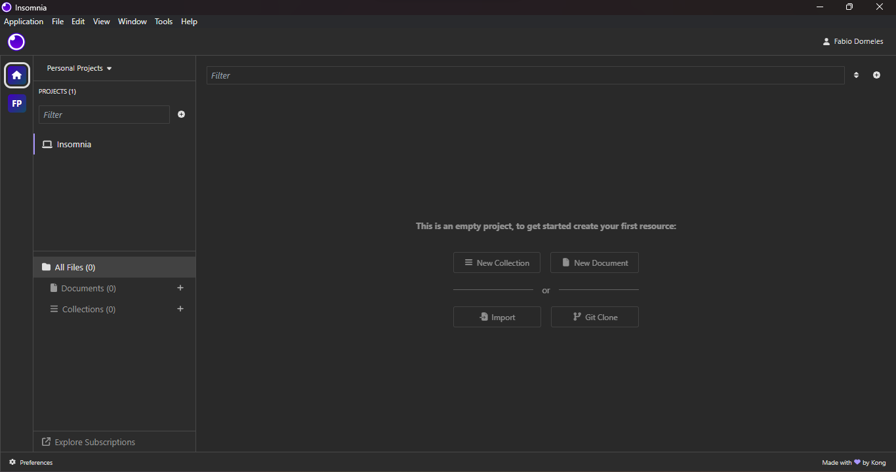

# Aplicação de Gerenciamento de Produtos
Esta aplicação é um servidor Node.js que permite o gerenciamento de produtos por meio da importação de um arquivo CSV. Ela utiliza as seguintes tecnologias e bibliotecas:

- <b>Node.js:</b> É uma plataforma para construção de aplicações server-side altamente escaláveis.
- <b>Express:</b> É um framework web para Node.js que facilita a criação de aplicativos web e APIs.
- <b>insomnia</b> O Insomnia é uma ferramenta de teste de API que permite aos desenvolvedores enviar solicitações HTTP, testar endpoints e depurar APIs de forma eficiente, oferecendo uma interface amigável e recursos avançados para simplificar o processo de desenvolvimento e depuração de APIs.
- <b>Multer:</b> É uma biblioteca para Node.js que lida com uploads de arquivos, permitindo que você receba arquivos enviados pelo cliente.
- <b>Prisma:</b> É uma ferramenta de ORM (Object-Relational Mapping) para Node.js e TypeScript que simplifica o acesso ao banco de dados.
- <b>TypeScript:</b> É um superset tipado do JavaScript que traz a capacidade de adicionar tipos estáticos ao código.
- <b>MySQL:</b> É um sistema de gerenciamento de banco de dados relacional amplamente utilizado, conhecido por sua confiabilidade e eficiência. É uma escolha popular para armazenar e recuperar dados em aplicações web e servidores, oferecendo recursos avançados de consulta e escalabilidade.

# Funcionalidades Principais

## 1. Importação de Produtos via CSV
- A principal funcionalidade desta aplicação é permitir a importação de produtos a partir de um arquivo CSV.
- O arquivo CSV deve seguir um modelo específico com os campos: código de barras (code_bar), descrição (description), preço (price) e quantidade (quantity).
- A aplicação lê o arquivo CSV, verifica se os produtos já existem no banco de dados e, se não existirem, os adiciona.

## 2. Contagem de Produtos Adicionados
- A aplicação mantém um contador para acompanhar quantos produtos foram adicionados durante a importação.
- Após a importação, a aplicação retorna uma resposta JSON que inclui os produtos lidos do arquivo e a quantidade de produtos adicionados.

# Como Usar

## Requisitos
- Node.js v14.18.1 ou superior
- Yarn v1.22.10 ou superior (opcional)
- TypeScript v5.2.2 ou superior

# Clonando o Repositório
Para clonar o repositório, abra um terminal e digite o seguinte comando:
```bash
git clone https://github.com/fabiodrneles/08
```
## Instalando as Dependências
Para instalar as dependências da aplicação, abra um terminal no diretório "08" e digite o seguinte comando:
```bash
npm install
```
Ou, se você estiver usando Yarn:
```bash
yarn install
```
## Rodando a Aplicação em Desenvolvimento
Para rodar a aplicação em desenvolvimento, abra um terminal no diretório "08" e digite o seguinte comando:
```bash
npm run dev
```
Ou, se você estiver usando Yarn:
```bash
yarn dev
```
A aplicação será iniciada no seu navegador padrão.

## Rodando a Aplicação em Produção
Para rodar a aplicação em produção, abra um terminal no diretório "08" e digite o seguinte comando:
```bash
npm run start
```
Ou, se você estiver usando Yarn:
```bash
yarn start
```
A aplicação será iniciada no seu navegador padrão.
# Observações
- O comando <b>git clone </b>clona o repositório do GitHub para o seu computador.
- O comando <b>npm install </b>ou <b>yarn install </b>instala as dependências da aplicação.
- O comando <b>npm run dev </b>ou <b>yarn run dev </b>roda a aplicação em desenvolvimento, usando o <b>ts-node-dev </b>para executar o código TypeScript.
 O comando <b>npm run start</b> ou <b>yarn start</b> roda a aplicação em produção, compilando o código TypeScript para JavaScript e usando o Node.js para executá-lo.

# Utilizando o Insomnia

Para testar as rotas da aplicação e interagir com a API de gerenciamento de produtos, você pode utilizar o <b>Insomnia</b>, uma ferramenta de teste de API.
## Passos para Configurar o Insomnia:
- Faça o download e instale o Insomnia no seu computador, se você ainda não o tiver.
```bash
https://insomnia.rest/download
```
- Abra o Insomnia e siga os passos abaixo para importar as requisições( não é necessário criar uma conta se ainda não desejar, o insomnia abre mesmo sem fazer login).
- Clique em importar no centro da tela


- Ao abrir a tela para importar clique em Choose a file ou arraste o arquivo collection_08 que esta dentro dos arquivos da aplicação.


